## Jwaban Interview PT. Global Sukses Solusi (RUN System)

Sebelumnya saya mohon maaf mengganggu waktu dari Pak Budi, Pak Tedi, dan Bu Cahya. Terima kasih telah memberikan saya waktu dan kesempatan untuk menjawab pertanyaan pada saat interview pada hari Rabu, 15 Juni 2022. Berikut jawaban saya mengenai pertanyaan pada saat interview yang belum terjawab.

### Mengganti ip address pada konfigurasi reverse proxy nginx

- Buka file `sudo nano /etc/hosts` dan tambahkan ip-address dan nama host yang diinginkan seperti gambar di bawah ini.

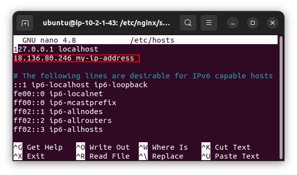

- lalu ganti ip-address pada konfigurasi reverse proxy nginx dengan vhost yang sudah dibuat

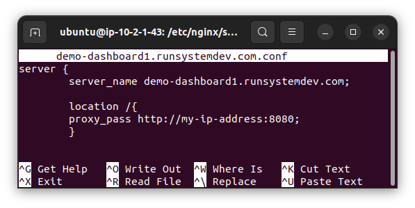

### Automated Deployment with Jenkins

- Jenkins berjalan di port 8080 dan saya menggunakan domain `...` agar jenkins dapat mengakses https dan melakukan webhook ke repo, disini saya menggunakan repo GitHub.

- login dengan username dan password yang telah dibuat. username: ... & pass: ...

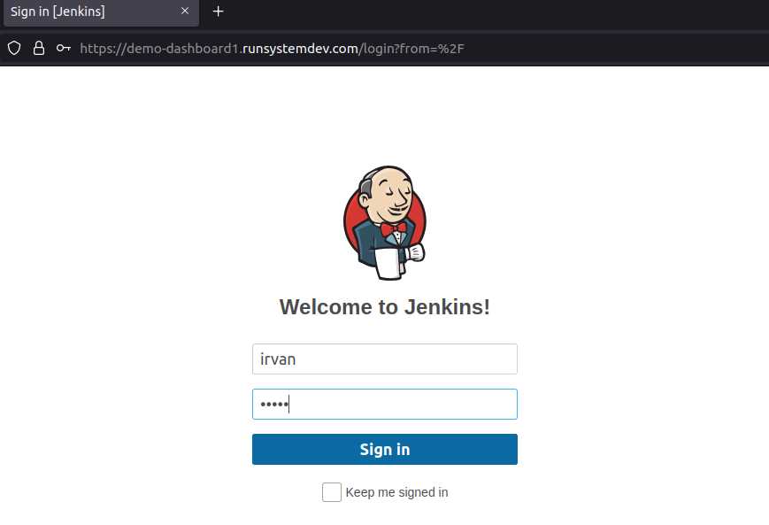

- Install plugin tambahan ssh agent dengan masuk ke manage jenkins > plugin manager > pilih menu available > cari ssh agent > lalu install ssh agent

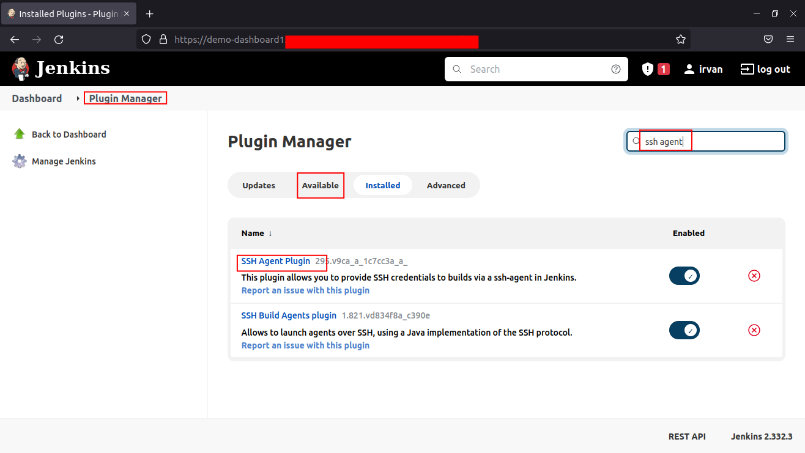

- Membuat credential untuk conect ke server meggunakan private key dengan cara masuk Manage jenkins > Manage Credentials > Add credentials

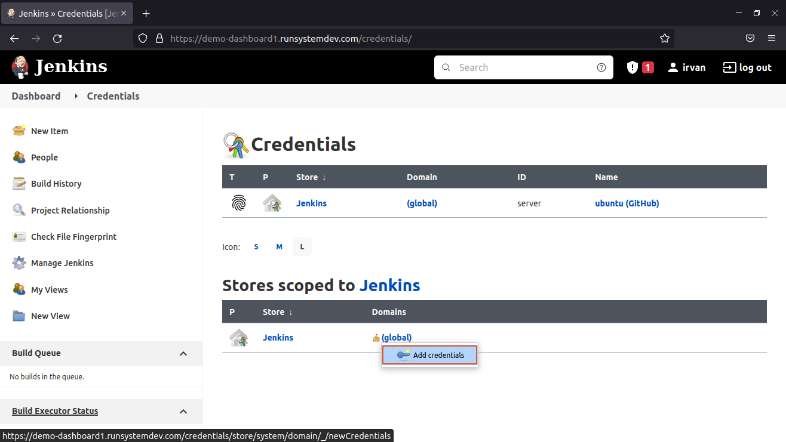

- Pilih kind "SSH Username with private key" > Scope "Global" > ID "masukkan ID" > masukkan Description > masukkan username credential

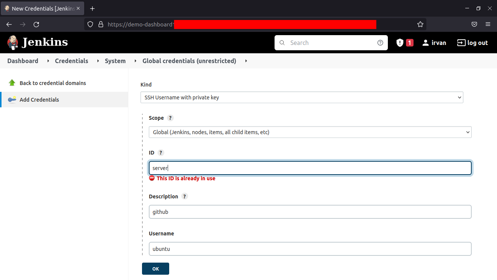

- Masukkan private key server

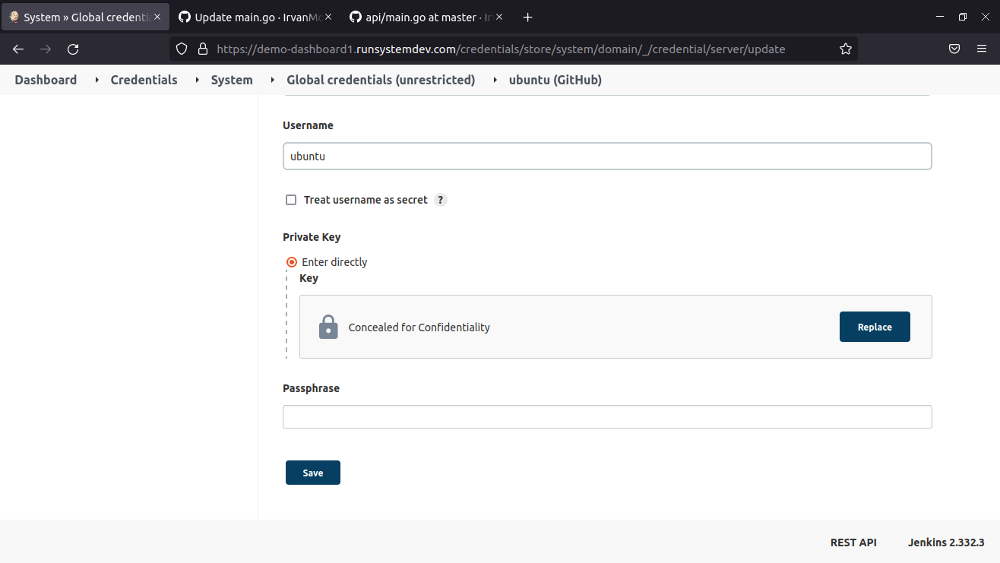

- Kembali ke Dashboard > pilih New Item untuk membuat job > masukkan nama job dan pilih pipeline

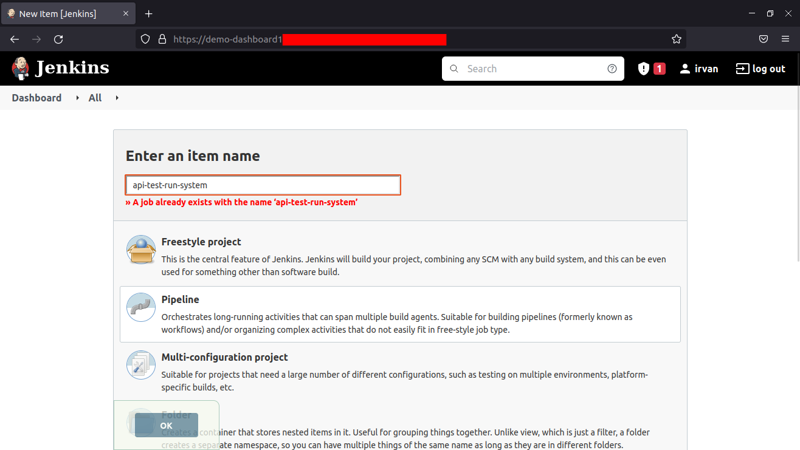

- Centang pad bagian Build Triggers "GitHub hook trigger for GITScm polling" agar dapat melakukan webhook dan otomatis men-triggger job dan menjalankan-nya ketika ada perubahan pada repo

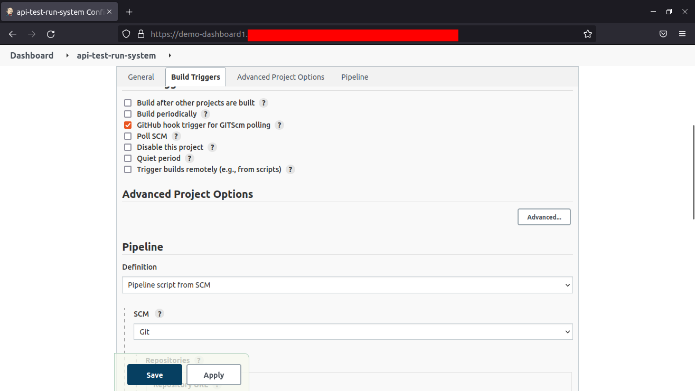

- Pada bagian Pipeline pilih Definition "Pipeline script from SCM" > SCM pilih "Git" > Masukkan URL repo github > pilih credential yang sudah dibuat.

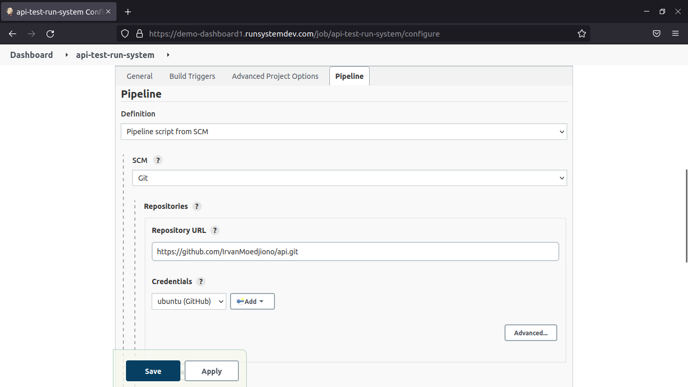

- Pada "Branch Specifier" masukkan branch repo > pada bagian Script Path masukkan nama file script pipeline, disini saya membuat Scipt file [Jenkinsfile](Jenkinsfile) > Klik Apply dan Save

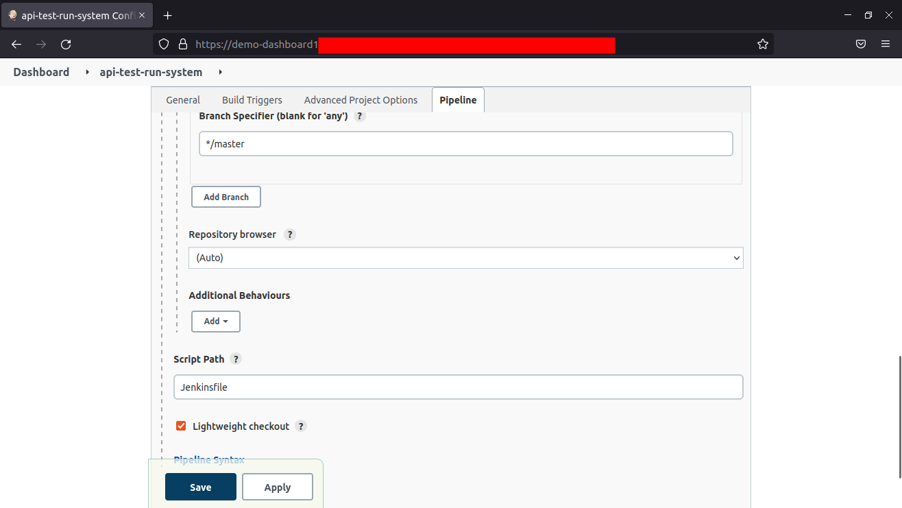

- Kembali ke Dashboard dan akan terlihat job yang telah dibuat.

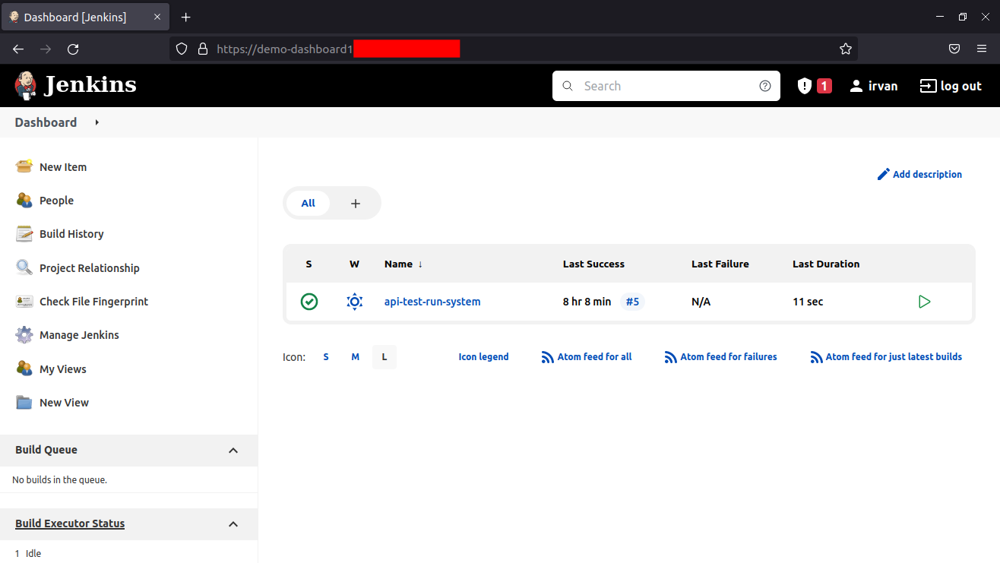

- Masuk ke Repo GitHub lalu pilih Settings > Webhooks > Add webhook

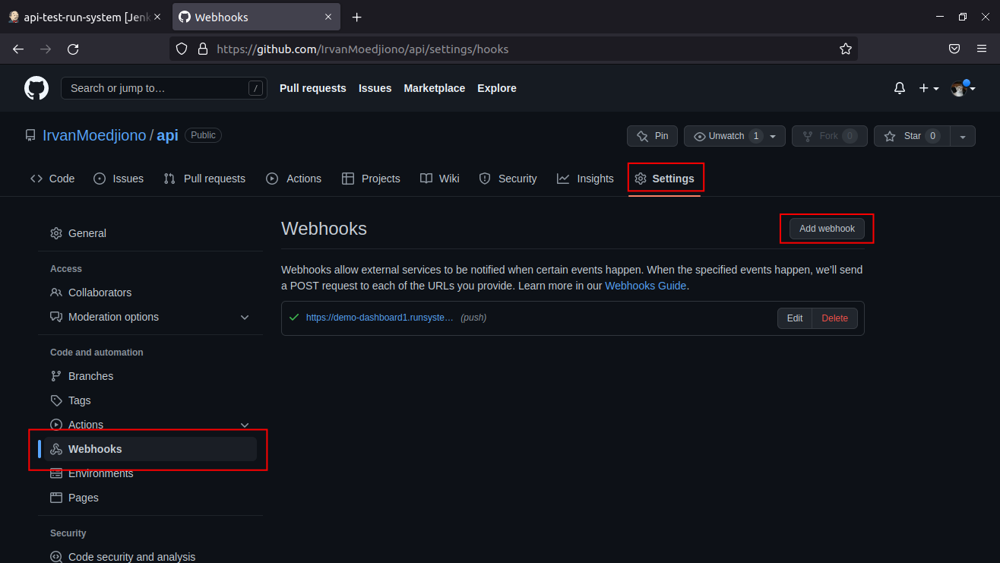

- Pada bagian "Payload URL" masukkan domain https jenkins dan tambahkan `/github-webhook/` seperti gambar di bawah

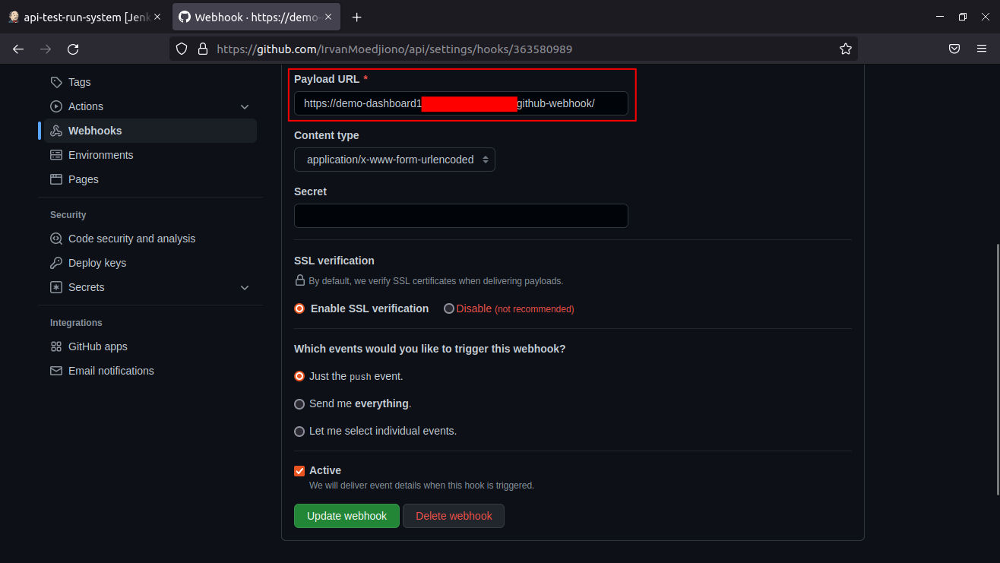

- Lakukan commit perubahan pada repo github atau git push perubahan. disini saya merubah file main.go yang semula menampilkan "Hello API Test-Devops" menjadi "Hello API"

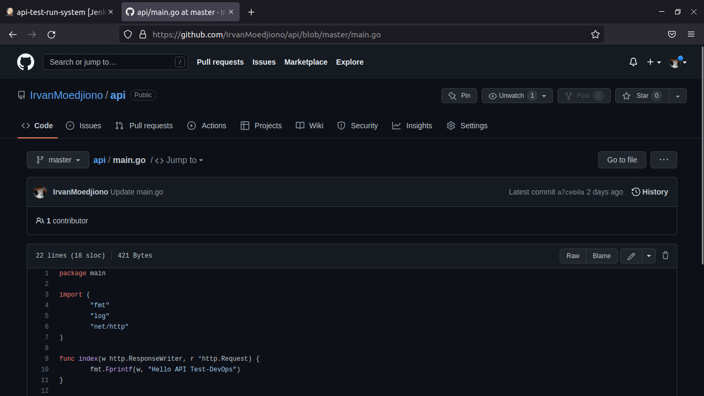

- Ketika ada perubahan pada repo maka job otomatis ter-trigger dan menjalankan script [Jenkinsfile](Jenkinsfile) pada server dan melakukan otomatisasi sesuai script yang telah dibuat.

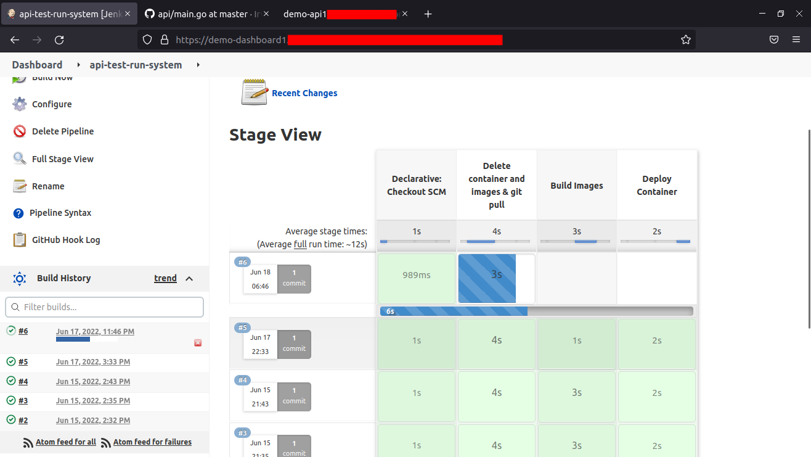

Before

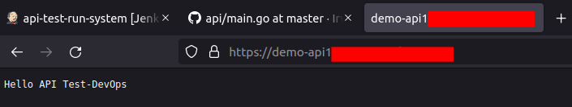

After

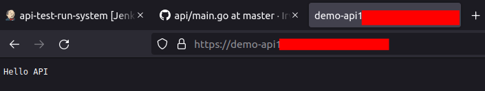

- Untuk cek detail log dapat melalui Dashboard > pilih Job > pilih Changes

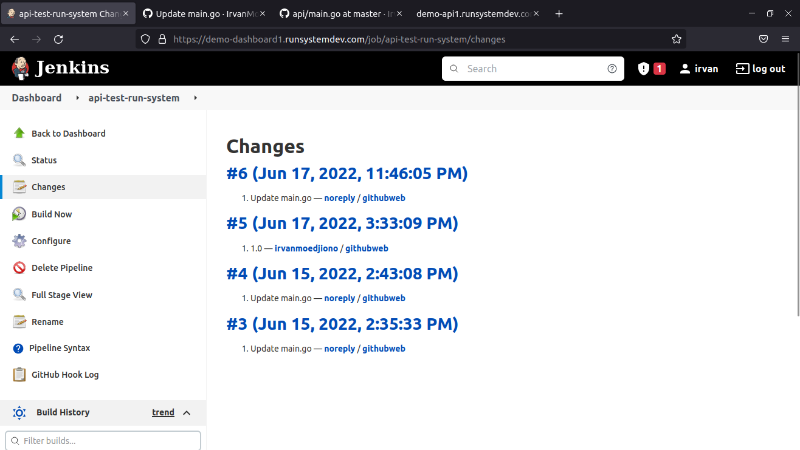

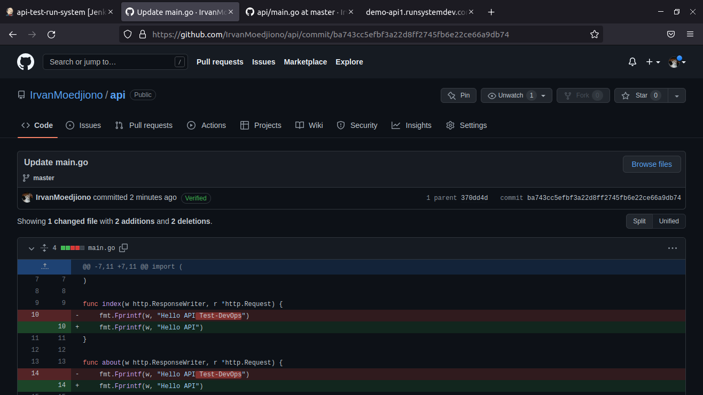

### Algoritma/Metode Load Balancing

1. Round Robin : membagi beban secara bergiliran dan berurutan dari satu server ke server lain. atau ketika koneksi client melakukan request sampai ke server terakhir maka client berukutnya akan kembali ke server pertama.
2. Ratio : membagi beban dengan cara memberi rasio pada setiap servernya.
3. Fastest/Least Response Time : pembagian beban dengan cara menutamakan server-server yang memiliki respon paling cepat. 
4. Least Connection : Melakukan pembagian berdasarkan banyaknya koneksi. Server yang paling sedikit melayani koneksi client maka server tersebut yang akan mengambil request berikutnya dari client.
